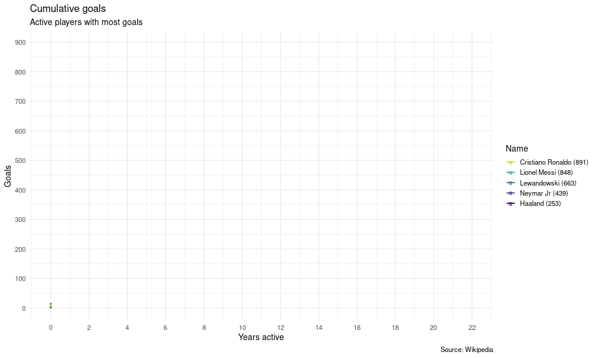

<!-- README.md is generated from README.Rmd. Please edit that file -->

# goal500

<!-- badges: start -->

[](https://lifecycle.r-lib.org/articles/stages.html#experimental)
[](https://github.com/jtrecenti/goal500/actions)
<!-- badges: end -->

Esse repositório mostra os gols dos principais artilheiros ainda ativos,
com base nas estatísticas disponíveis no Wikipédia.

## Installation

``` r
remotes::install_github("jtrecenti/goal500")
```

## Gráfico

``` r
library(ggplot2)
library(gganimate)
library(goal500)

da <- get_player_stats()

da_plot <- da %>% 
  dplyr::filter(!is.na(total)) %>% 
  dplyr::mutate(year = as.numeric(year)) %>% 
  dplyr::group_by(name, year) %>% 
  dplyr::summarise(total = sum(total), .groups = "drop_last") %>% 
  dplyr::arrange(year) %>% 
  dplyr::mutate(total_cumsum = cumsum(total)) %>% 
  dplyr::group_by(name) %>% 
  dplyr::mutate(total_player = sum(total), year = year - min(year)) %>% 
  dplyr::ungroup() %>% 
  dplyr::mutate(
    name = stringr::str_glue("{name} ({total_player})"),
    name = forcats::fct_reorder(name, total_player)
  )

gg <- da_plot %>% 
  ggplot(aes(x = year, y = total_cumsum, colour = name)) +
  geom_point(size = .8) +
  geom_line(size = .9) +
  geom_text(
    aes(label = name),
    data = da_plot %>% 
      dplyr::arrange(dplyr::desc(year)) %>% 
      dplyr::distinct(name, .keep_all = TRUE)
  ) +
  scale_colour_viridis_d(end = .9) +
  scale_x_continuous(breaks = 0:20 * 2) +
  scale_y_continuous(breaks = 0:10 * 100) +
  theme_minimal(14) +
  guides(colour = guide_legend(reverse = TRUE)) +
  labs(
    x = "Years active", 
    y = "Goals",
    colour = "Name",
    title = "Cumulative goals",
    subtitle = "Active players with most goals",
    caption = "Source: Wikipedia"
  ) +
  transition_reveal(year) +
  enter_grow()

# https://github.com/thomasp85/gganimate/issues/431#issuecomment-803363466
animate(
  gg, 
  nframe = 26,
  fps = 2,
  end_pause = 5,
  width = 1000, 
  height = 600
)
```


