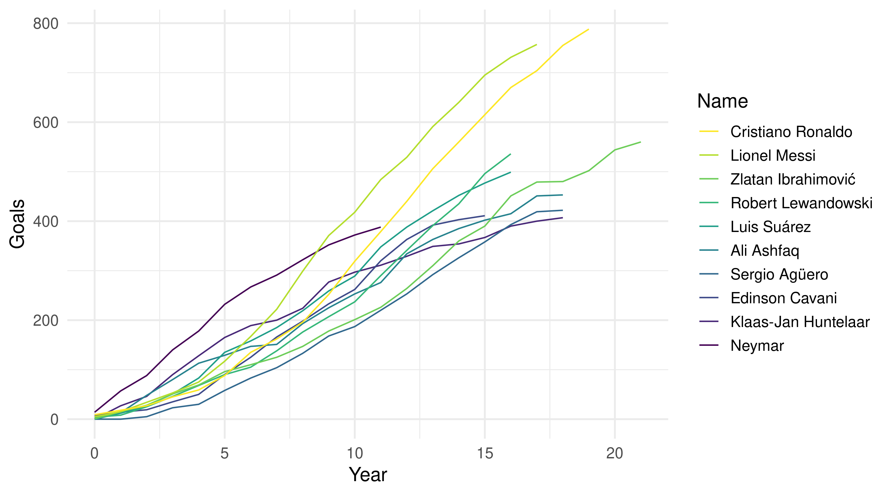
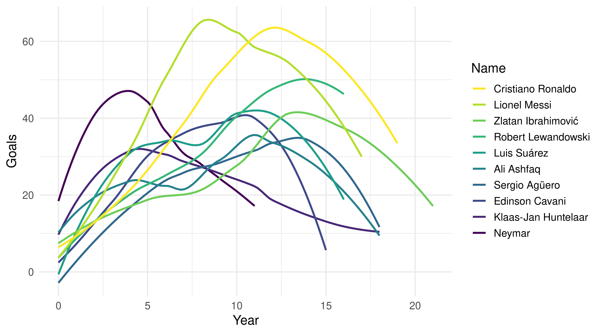

<!-- README.md is generated from README.Rmd. Please edit that file -->

# goal500

<!-- badges: start -->

[](https://lifecycle.r-lib.org/articles/stages.html#experimental)
<!-- badges: end -->

The goal of goal500 is to …

## Installation

## Gráfico

``` r
library(ggplot2)
library(goal500)

da <- get_player_stats()

da_plot <- da %>% 
  dplyr::filter(!is.na(total)) %>% 
  dplyr::mutate(year = as.numeric(year)) %>% 
  dplyr::group_by(name, year) %>% 
  dplyr::summarise(total = sum(total), .groups = "drop_last") %>% 
  dplyr::arrange(year) %>% 
  dplyr::mutate(total_cumsum = cumsum(total)) %>% 
  dplyr::group_by(name) %>% 
  dplyr::mutate(total_player = sum(total), year = year - min(year)) %>% 
  dplyr::ungroup() %>% 
  dplyr::mutate(name = forcats::fct_reorder(name, total_player))

da_plot %>% 
  ggplot(aes(year, total_cumsum, colour = name)) +
  geom_line() +
  scale_colour_viridis_d() +
  theme_minimal(14) +
  guides(colour = guide_legend(reverse = TRUE)) +
  labs(x = "Year", y = "Goals", colour = "Name")
```



``` r
da_plot %>% 
  ggplot(aes(year, total, colour = name)) +
  geom_smooth(se = FALSE) +
  scale_colour_viridis_d() +
  theme_minimal(14) +
  guides(colour = guide_legend(reverse = TRUE)) +
  labs(x = "Year", y = "Goals", colour = "Name")
#> `geom_smooth()` using method = 'loess' and formula 'y ~ x'
```


